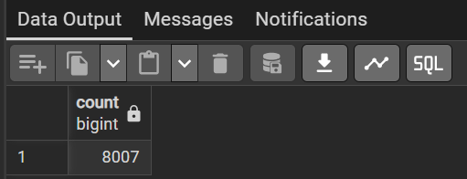
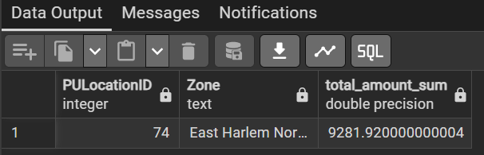

This file contains my answers to Module 1 Homework: Docker & SQL from the Data Engineering Zoomcamp 2026. The practical component of the assignment focuses on building a **data ingestion pipeline** using **Docker**, **PostgreSQL**, and **pgAdmin**, with particular emphasis on ingesting **NYC taxi data from Parquet files** and querying the ingested data using **SQL** to answer analytical questions. The supporting **coding files** used for data ingestion and querying can be found in this folder.

## Question 1. Understanding Docker images
Run docker with the python:3.13 image. Use an entrypoint bash to interact with the container.
What's the version of pip in the image?

**Solution**:
```bash docker run -it --entrypoint bash python:3.13
pip --version
```

Using the official python:3.13 Docker image, running pip --version inside the container reports pip **25.3**.


## Question 2. Understanding Docker networking and docker-compose
Given the following docker-compose.yaml, what is the hostname and port that pgadmin should use to connect to the postgres database?

```bash
services:
  db:
    container_name: postgres
    image: postgres:17-alpine
    environment:
      POSTGRES_USER: 'postgres'
      POSTGRES_PASSWORD: 'postgres'
      POSTGRES_DB: 'ny_taxi'
    ports:
      - '5433:5432'
    volumes:
      - vol-pgdata:/var/lib/postgresql/data

  pgadmin:
    container_name: pgadmin
    image: dpage/pgadmin4:latest
    environment:
      PGADMIN_DEFAULT_EMAIL: "pgadmin@pgadmin.com"
      PGADMIN_DEFAULT_PASSWORD: "pgadmin"
    ports:
      - "8080:80"
    volumes:
      - vol-pgadmin_data:/var/lib/pgadmin

volumes:
  vol-pgdata:
    name: vol-pgdata
  vol-pgadmin_data:
    name: vol-pgadmin_data
```

**Solution:** Because Docker Compose creates an internal network where services can reach each other by service name, and PostgreSQL listens on port 5432 inside its container, so pgAdmin connects to **db:5432**


## Question 3. Counting short trips
For the trips in November 2025 (lpep_pickup_datetime between '2025-11-01' and '2025-12-01', exclusive of the upper bound), how many trips had a trip_distance of less than or equal to 1 mile?

**Solution:**

```bash
SELECT COUNT(*) FROM public.green_taxi_trips_2025_11
WHERE lpep_pickup_datetime between '2025-11-01' and '2025-12-01'
AND trip_distance<=1;
```



## Question 4. Longest trip for each day
Which was the pick up day with the longest trip distance? Only consider trips with trip_distance less than 100 miles (to exclude data errors).

**Solution:**

Use the pick up time for your calculations.

```bash 
SELECT
  DATE(lpep_pickup_datetime) AS pickup_day,
  trip_distance
FROM public.green_taxi_trips_2025_11
WHERE trip_distance < 100
ORDER BY trip_distance DESC
LIMIT 1;
```


## Question 5. Biggest pickup zone
Which was the pickup zone with the largest total_amount (sum of all trips) on November 18th, 2025?

**Solution:**

```bash
WITH sums AS (
SELECT
    t."PULocationID",
    SUM(t.total_amount) AS total_amount_sum
FROM public.green_taxi_trips_2025_11 t
WHERE DATE(t.lpep_pickup_datetime) = '2025-11-18'
GROUP BY t."PULocationID"
)
SELECT
  s."PULocationID",
  z."Zone",
  s.total_amount_sum
FROM sums s
JOIN public.taxi_zones z ON z."LocationID" = s."PULocationID"
ORDER BY s.total_amount_sum DESC
LIMIT 1;
```



## Question 6. Largest tip
For the passengers picked up in the zone named "East Harlem North" in November 2025, which was the drop off zone that had the largest tip?

**Solution:**

```bash
WITH ehn AS (
SELECT "LocationID"
FROM public.taxi_zones
WHERE "Zone" = 'East Harlem North'
)
SELECT z_do."Zone" AS dropoff_zone, MAX(t.tip_amount) AS total_tip
FROM public.green_taxi_trips_2025_11 t
JOIN ehn
  ON t."PULocationID" = ehn."LocationID"
JOIN public.taxi_zones z_do
  ON z_do."LocationID" = t."DOLocationID"
WHERE t.lpep_pickup_datetime >= timestamp '2025-11-01'
  AND t.lpep_pickup_datetime <  timestamp '2025-12-01'
GROUP BY z_do."Zone"
ORDER BY total_tip DESC
LIMIT 1;
```


## Question 7. Terraform Workflow
Which of the following sequences, respectively, describes the workflow for:
1. Downloading the provider plugins and setting up backend,
2. Generating proposed changes and auto-executing the plan
3. Remove all resources managed by terraform`

Solution:
- `terraform init` downloads provider plugins and configures the backend.
- `terraform apply -auto-approve` generates the execution plan and automatically applies the proposed changes.
- `terraform destroy` removes all resources managed by Terraform.

Correct sequence: terraform init, terraform apply -auto-approve, terraform destroy.
