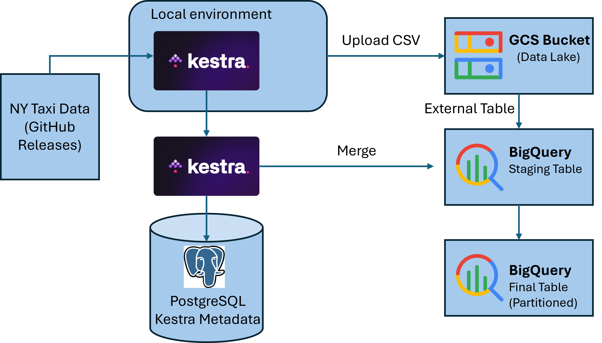
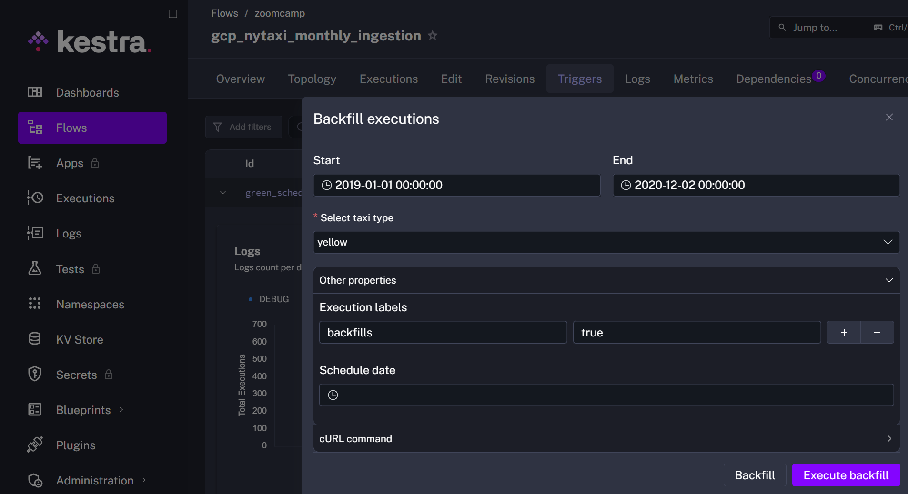
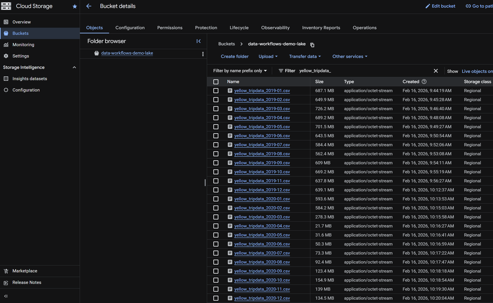
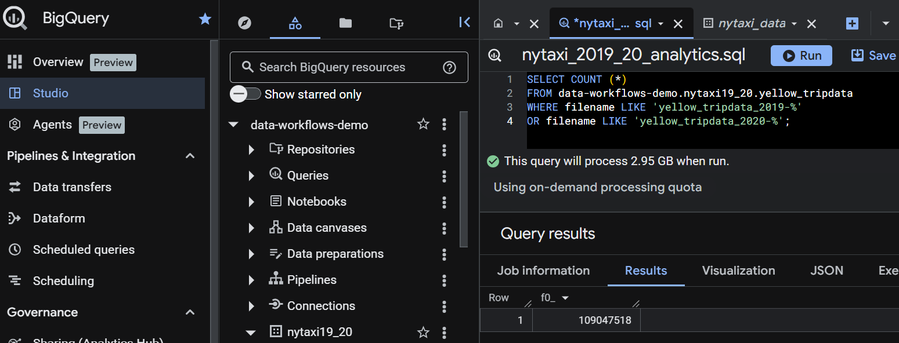

# Workflow Orchestration & Cloud ELT
This project builds and orchestrates an **ELT pipeline with Kestra**:
- **Extract**: Download NYC Taxi monthly data from GitHub Releases
- **Load**: Store the raw CSV files in Google Cloud Storage (GCS) as a data lake
- **Transform**: Perform data transformations in BigQuery and merge the results into partitioned warehouse tables



Unlike traditional ETL (Extract → Transform → Load), ELT first loads raw data into the data warehouse and performs transformations afterward using the warehouse’s compute power.

## Overview and Tools
This project implements a cloud ELT pipeline orchestrated with Kestra, using Google Cloud Storage (GCS) as the data lake and BigQuery as the cloud data warehouse. Below are the key technologies used and their purpose in this project:

- **Docker + Docker Compose**: Runs everything locally with one command; creates an isolated network and persistent volumes for Kestra + Postgres.

- **Kestra**: A workflow orchestration engine that executes ELT steps defined in YAML flows. It manages task execution, Key-Value (KV) configuration, secrets, and integrations with GCP plugins.
    
- **PostgreSQL (kestra_postgres)**: Kestra’s metadata/state database (executions, queue, repository). Keeps workflow history and scheduling reliable.

- **Google Cloud Storage (GCS)**: the data lake layer (bucket). In this module it’s also where raw/landing files would live.

- **BigQuery**: the cloud data warehouse (dataset). Destination for analytics tables and transformations (ELT pattern).

- **GCP Service Account key** (stored as Kestra secret): authenticates Kestra’s GCP plugin calls such as creating buckets, datasets, and running BigQuery jobs.

## Prepare credentials as a Kestra secret
Committing raw JSON credentials to a repository is insecure. This step is to safely insert GCP Key into Kestra using environment-based secret management.

1. Download the GCP Service Account Key as a JSON file.
2. Place the **service account key JSON** (e.g. `workflows_k.json`) in the project folder:
3. Base64-encode it into an env file Kestra can read:
```bash
echo SECRET_GCP_SA_KEY=$(cat workflows_k.json | base64 -w 0) >> .env_encoded
```
4. Load it in [`docker-compose.yml`](./docker-compose.yml):
`env_file: .env_encoded`
Alternatively reading multiple keys:
```bash
while IFS='=' read -r key value; do
echo "SECRET_${key}=$(echo -n "$value" | base64)"
done < .env_keys > .env_encoded
```
5. Reference it inside Kestra flows (`gsp_setup.yml`):
`{{secret('GCP_SA_KEY')}}`


## Start the local orchestration stack with Docker
```bash
docker compose up -d
```
This starts the following services:


| Services | Image | Port | Description |
|----------|-------|-------------|-------------|
| kestra | kestra/kestra:v1.1 | 8080 | Runs Kestra server (UI + API + executor) |
| kestra_postgres | postgres:18 | - | Stores Kestra Metadata |

Next, access the Kestra UI at: 
```arduino
http://localhost:8080
```

## Flow 1 — gcp_kv (Set Configuration in Kestra KV)
This flow initializes reusable configuration values using Kestra’s Key-Value store. It creates a centralized GCP configuration that acts as a “single source of truth” for later flows.

Run the [`gcp_kv`](./gcp_kv.yml) flow to store reusable config values:

| Key | Value (Placeholder) |
|----------|-------|
| GCP_PROJECT_ID | data-workflows-demo |
| GCP_LOCATION | eur3 |
| GCP_BUCKET_NAME | data-workflows-demo-lake |
| GCP_DATASET | nytaxi19_20 |

Why this matters:
- Avoids hardcoding project configuration
- Makes flows reusable
- Simplifies environment changes

## Flow 2 — gcp_setup (Provision Cloud Resources)

Run the [`gcp_setup`](./gcp_setup.yml) flow to provision required cloud infrastructure. This flow:
1. Connects to GCP using the service account secret:
```yaml
{{secret('GCP_SA_KEY')}}
```

2. Reads the following KV keys: `GCP_PROJECT_ID`, `GCP_LOCATION`, `GCP_BUCKET_NAME`, `GCP_DATASET`.

3. Creates: 
- A GCS bucket (idempotent: ifExists: SKIP)
- a BigQuery dataset (idempotent)

Note: using `ifExists: SKIP` makes the flow idempotent and safe to re-run.

## Flow 3 — gcp_nytaxi_monthly_ingestion (Monthly ingestion ➜ GCS ➜ BigQuery)
[This flow](./gcp_nytaxi_monthly_ingestion.yml) ingests NYC TLC **monthly** trip data (**green** or **yellow**) uploads the CSV to **GCS**, then loads it into **BigQuery** using an **external table ➜ staging table ➜ merge into partitioned final table** pattern.

#### Inputs and dynamic naming
The flow takes one input:

- **taxi**: green or yellow (default: green)

It then builds monthly file/table names from the trigger date:

- **file**: `{{taxi}}_tripdata_YYYY-MM.csv`
- **gcs_file**: `gs://<bucket>/<file>`
- **table (staging per month)**: `<dataset>.<taxi>_tripdata_YYYY_MM`

This means the same flow works for:

- scheduled monthly runs (current month based on schedule time)
- backfills (when run for historical trigger dates)

### Tasks
1. Label the execution
```yaml
io.kestra.plugin.core.execution.Labels
```
Adds labels like:

- **file**: `green_tripdata_2019-01.csv`
- **taxi**: `green`

This makes it easier to filter executions in the UI.

2. Extract: download and unzip the monthly file

```bash
wget ... .gz | gunzip > <file>.csv
```

- Pulls data from:  `https://github.com/DataTalksClub/nyc-tlc-data/releases`
- Saves the `.csv` as an execution output file:

```yaml
outputFiles: ["*.csv"]
```

3. Upload files to the GCS Bucket
```yaml
io.kestra.plugin.gcp.gcs.Upload
```

- `from`: the downloaded CSV file from the `extract` task output  
- `to`: `gs://{{kv('GCP_BUCKET_NAME')}}/<file>.csv`

This creates a persistent landing file in the data lake.

4. Branch by dataset (taxi type green vs yellow)
Two `If` blocks control the schema and final destination table:

- `if_yellow_taxi` ➜ `yellow_tripdata`
- `if_green_taxi` ➜ `green_tripdata`

This is important because **green and yellow schemas differ**.

### Creation of the "final" table

**A. Create final partitioned table if missing**

For yellow:
```sql
CREATE TABLE IF NOT EXISTS ...yellow_tripdata (...)
PARTITION BY DATE(tpep_pickup_datetime);
```

For green:
```sql
PARTITION BY DATE(lpep_pickup_datetime);
```

**B. Create an external table over the single CSV in GCS**

External table allows a fast way to read the raw CSV without a separate load job. It stores no data itself, but simply references the CSV file located in your cloud storage bucket.

```sql
OPTIONS (
format = 'CSV',
uris = ['{{render(vars.gcs_file)}}'],
skip_leading_rows = 1,
ignore_unknown_values = TRUE
);
```

**C. Create a monthly staging table and add metadata columns**

Next, a unique identifier and a label is assigned to each record that will allow us to know later which file each piece of data comes from.

```sql
CREATE OR REPLACE TABLE ...<dataset>.<taxi>_tripdata_YYYY_MM AS
SELECT
  MD5(CONCAT(...)) AS unique_row_id,
  "file.csv" AS filename,
  *
FROM ..._ext;
```
This:
- Adds `unique_row_id` derived from key trip attributes
- Adds `filename` for lineage/debugging
- Materializes the month into a normal BigQuery table (staging)

**D. MERGE monthly staging into final table**

As a final step, the downloaded data will combine be combined the data in the "final" table. **Merge** avoids duplicating rows (based on the hash keys) when the same month is reprocessed and supports backfills safely.

```sql
MERGE INTO final T
USING staging S
ON T.unique_row_id = S.unique_row_id
WHEN NOT MATCHED THEN INSERT ...
```

5. Cleanup execution files
The final step removes the downloaded CSV from Kestra’s internal execution storage, since the file is now safely stored in GCS.

```yaml
io.kestra.plugin.core.storage.PurgeCurrentExecutionFiles
```


## Scheduling
Two schedules are defined:
- Green taxi: `0 9 1 * *` ➜ runs on the **1st of every month at 09:00**
- Yellow taxi: `0 10 1 * *` ➜ runs on the **1st of every month at 10:00**

```sql
triggers:
  - id: green_schedule
    type: io.kestra.plugin.core.trigger.Schedule
    cron: "0 9 1 * *"
    inputs:
      taxi: green

  - id: yellow_schedule
    type: io.kestra.plugin.core.trigger.Schedule
    cron: "0 10 1 * *"
    inputs:
      taxi: yellow
```

## Backfills
Kestra’s Backfill feature is used to load historical monthly taxi data.

By selecting a date range (e.g., **2019-01-01 to 2020-12-01**) and a taxi type (`yellow` or `green`), Kestra automatically creates one execution per scheduled month.

Because the flow uses:
```yaml
{{trigger.date | date('yyyy-MM')}}
```
each execution dynamically downloads and loads the correct monthly dataset.



After this backfill process, the data is available in **GCS Bucket**.



Data is merged into the **partitioned BigQuery tables**.



## Summary
- Built an end-to-end ELT pipeline using Kestra
- Ingested NYC Taxi monthly data from GitHub
- Stored raw data in GCS (data lake)
- Transformed and merged data in BigQuery (data warehouse)
- Implemented partitioned tables for performance optimization
- Used MERGE logic for idempotent and backfill-safe processing
- Automated monthly scheduling and historical backfills
- Applied secure secret management for GCP credentials