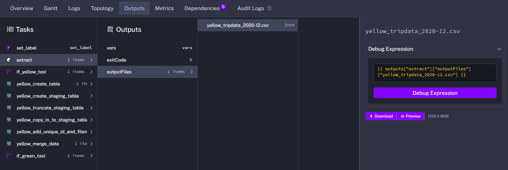
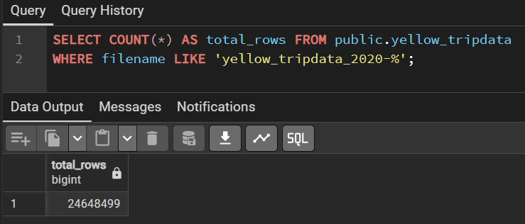
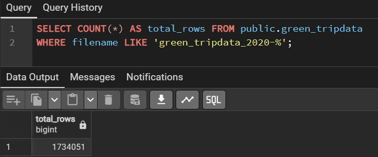
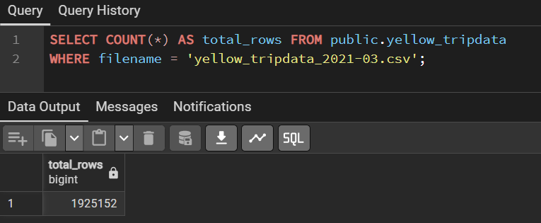
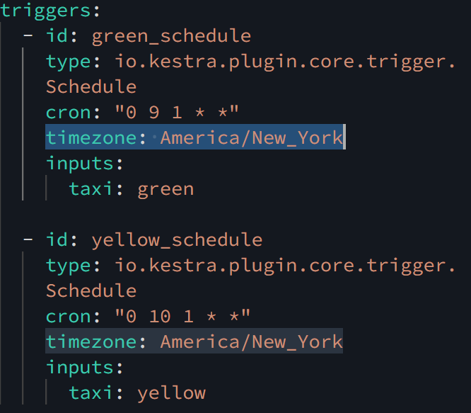

This file contains my solutions for Module 02 Homework: Workflow Orchestration from the Data Engineering Zoomcamp 2026, focusing on orchestrating ETL and ELT pipelines with Kestra using NYC taxi data across both local (Docker + PostgreSQL) and cloud (GCS + BigQuery) environments.

## Question 1.
Within the execution for `Yellow` Taxi data for the year `2020` and month `12`: what is the uncompressed file size (i.e. the output file `yellow_tripdata_2020-12.csv` of the `extract` task)?

**Solution**: By disabling the `PurgeCurrentExecutionFiles` task, the uncompressed output file becomes visible in the execution details. The size of `yellow_tripdata_2020-12.csv` is **128.3 MiB**.




## Question 2.
What is the rendered value of the variable `file` when the inputs `taxi` is set to `green`, `year` is set to `2020`, and `month` is set to `04` during execution?

**Solution**:

The variable is defined in [postgres_taxi.yaml](./flows_kestra/postgres_taxi.yaml#L25-L26) file as:

```
yaml
variables:
  file: "{{inputs.taxi}}_tripdata_{{inputs.year}}-{{inputs.month}}.csv"
```

Substituting the input values:

- `{{inputs.taxi}}` → `green`  
- `{{inputs.year}}` → `2020`  
- `{{inputs.month}}` → `04`  

**Rendered value:** green_tripdata_2020-04.csv


## Question 3.
How many rows are there for the `Yellow` Taxi data for all CSV files in the year `2020`?

**Solution**: 24,648,499 rows.




## Question 4.
How many rows are there for the `Green` Taxi data for all CSV files in the year `2020`?

**Solution**: 1,734,051 rows.




## Question 5.
How many rows are there for the `Yellow` Taxi data for the `March 2021` CSV file?

**Solution**: 1,925,152 rows.



## Question 6.
How would you configure the timezone to New York in a Schedule trigger?

**Solution**: Add a `timezone` property set to **`America/New_York`** in the Schedule trigger configuration

