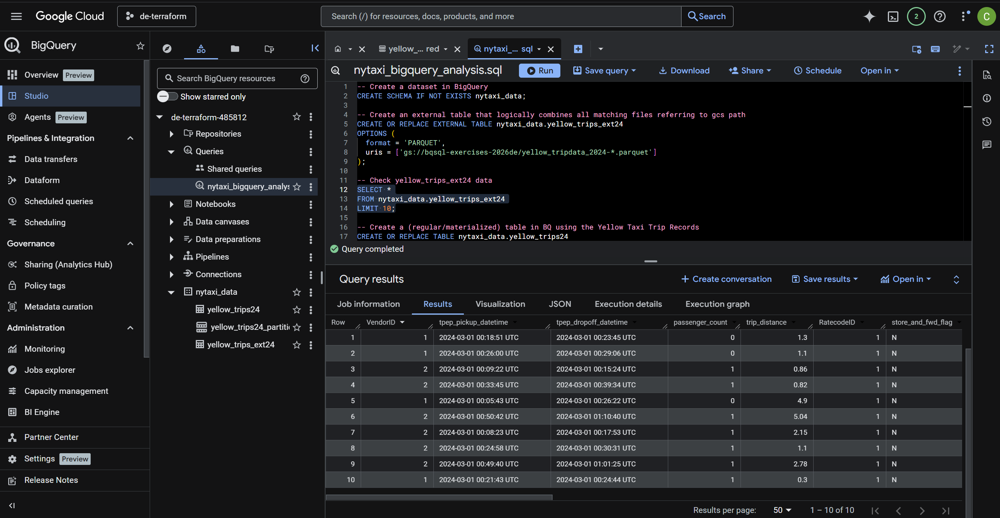
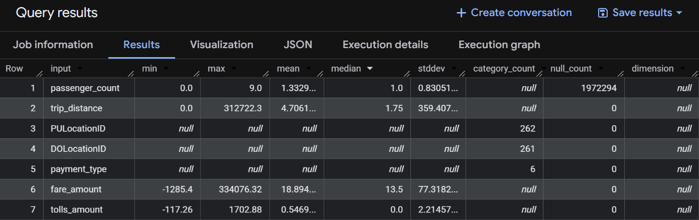
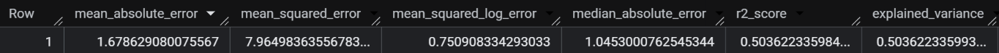
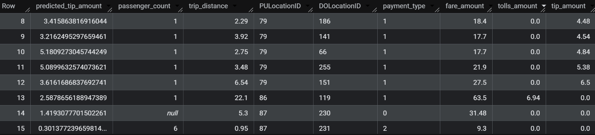
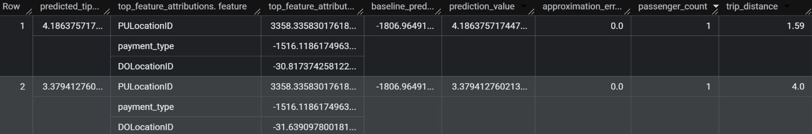
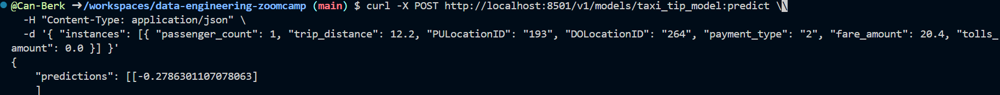

# Module 03 - Data Warehouse

## Overview
This module covers **cloud data warehouse workflow** using **Google BigQuery**, including:
- Data ingestion (Local → GCS → BigQuery)
- External vs materialized tables
- Partitioning and clustering optimization
- Query cost comparison
- BigQuery ML model training
- Hyperparameter tuning
- Model export and deployment using TensorFlow Serving

### Architecture Flow
Local ➜ Google Cloud Storage ➜ BigQuery External Table ➜ Materialized Table ➜ Partitioned & Clustered Table ➜ BigQuery ML ➜ TensorFlow Serving (Docker)

## Topics Covered
This module and project cover the following topics:

- [1. OLTP vs OLAP Systems](#1-olap-vs-oltp-systems)
- [2. Data Warehouse Fundamentals](#2-data-warehouse)
- [3. BigQuery Architecture & Storage](#3-bigquery-overview)
  - Columnar storage
  - Partitioning & clustering
  - External vs materialized tables
- [Exercise 1: Data Ingestion & Warehouse Optimization](#exercise-1-data-ingestion-pipeline-local--gcs--bigquery)
- [4. Machine Learning in BigQuery](#4-machine-learning-in-bigquery)
- [Exercise 2: BigQuery ML & Model Deployment](#exercise-2-machine-learning-model-deployment-bigquery-ml-model--exported-to-gcs--downloaded-locally--served-in-docker--queried-via-http
)
- [5. Key Learnings](#5-key-learnings)

## 1. OLTP vs OLAP Systems
OLTP systems handle real-time transactional operations, while OLAP systems are designed for large-scale analytical queries and reporting.


| Aspect        | OLTP (Online Transaction Processing) | OLAP (Online Analytical Processing) |
|:-------------|:------------------------------------:|:-----------------------------------:|
| Purpose      | Day-to-day operations                | Analytics & reporting               |
| Users        | Applications, clerks, customers      | Analysts, managers                  |
| Operations   | Insert, update, delete               | Complex queries & aggregations      |
| Data size    | Small per transaction                | Very large historical datasets      |
| Query type   | Simple & fast                        | Complex & heavy                     |
| Response time| Milliseconds                         | Seconds to minutes                  |
| Schema       | Highly normalized                    | Denormalized (star/snowflake)       |
| Data freshness| Real-time                           | Periodic loads                      |
| Examples     | Orders, payments, reservations       | Dashboards, trends, forecasts       |


## 2. Data Warehouse
A data warehouse is an OLAP system designed for analytical workloads. It typically processes data through a multi-step pipeline:

- **Extracts data** from multiple **source systems** (databases, applications, APIs, files)  
- Loads raw data into a **staging area** for temporary storage.
- **Cleans, transforms, and standardizes** data (ETL/ELT processes).  
- Loads processed data into **centralized analytical tables**.  
- Organizes data for **fast querying, aggregations, and reporting**.  
- Serves insights through **SQL queries**, **dashboards**, and **BI tools**.

## 3. BigQuery Overview
BigQuery is a serverless cloud data warehouse by Google Cloud, which allows users to perform scalable analytics without needing to manage resources such as RAM, CPUs, or even storage space.



### Key Concepts and Features
1. Serverless cloud data warehouse
    - No infrastructure to manage, automatically scales storage and compute.
    - Pay-as-you-go pricing based on storage and data processed.
2. Columnar Storage
    - Stores data by columns instead of rows, optimized for large analytical workloads.
    - Reads only the columns required for a query.
    - More cost- and performance-efficient since queries usually scan a subset of columns.
    
3. Partitioning and Clustering
    - **Partitioning** splits a table into manageable chunks (often by date) so queries scan only what’s needed.
    - **Clustering** organizes data by key columns to speed up filtering and joins.
    - Together they reduce cost and improve performance.

    [An example of creating a partitioned and clustered table from `nytaxi_bigquery_analysis.sql` can be found here:](./nytaxi_bigquery_analysis.sql#L47-L53)
    ```sql
        CREATE OR REPLACE TABLE nytaxi_data.yellow_trips24_partitioned_clustered
        PARTITION BY DATE(tpep_dropoff_datetime)
        CLUSTER BY VendorID
        AS
        SELECT *
        FROM nytaxi_data.yellow_trips24;
    ```
    When BigQuery only needs to get the data for a specific date, it will not read the whole data but only the relevant part. Additionally, sorts based on `VendorID` column within partitions. This helps to reduce costs and improve query performance because less data is processed.

     <br>

    A visual example:

    

    *Source: [Google Cloud Blog - BigQuery Storage Overview](https://cloud.google.com/blog/topics/developers-practitioners/bigquery-explained-storage-overview)*

4. Decoupled storage & compute
    BigQuery separates storage (Colossus) from compute (Dremel) and connects them with a high-bandwidth network (Jupiter) to run massive analytical queries in parallel.
    - **Colossus (storage)**: distributed columnar storage system that holds BigQuery data independently from compute.
    - **Dremel (query engine)**: executes SQL by breaking queries into a parallel tree of workers that scan and aggregate data.
    - **Jupiter (network)**: high-speed network that moves data between storage and compute across Google’s data centers.

5. Built-in analytics include
    - Standard SQL engine.
    - BigQuery ML (train ML models directly in SQL).
    - Integration with BI tools (Looker, Data Studio).


### External Tables vs. Materialized Tables
**External tables** do not store data inside BigQuery. They only keep **metadata** and **pointers** to files stored in **Google Cloud Storage (GCS)**, and BigQuery reads the data directly from those external files at query time.

```sql
CREATE OR REPLACE EXTERNAL TABLE nytaxi_data.yellow_trips_ext24
OPTIONS (
  format = 'PARQUET',
  uris = ['gs://bqsql-exercises-2026de/yellow_tripdata_2024-*.parquet']
);
```

**Materialized tables** store the data physically inside **BigQuery’s internal columnar storage**, allowing BigQuery to fully optimize queries for performance and cost.

```sql
CREATE OR REPLACE TABLE nytaxi_data.yellow_trips24
AS
SELECT *
FROM nytaxi_data.yellow_trips_ext24;
```

As a result, external tables are useful for quick access to data in GCS, while materialized tables are preferred for frequent analytics due to faster performance and better optimization.

<br>

[The cost difference of querying on a external and materialized table](./bigquery_analysis.md#L31-L37): BigQuery is able to use metadata for the external table query, while the materialized table query requires scanning the relevant column, resulting in higher data processed


## Exercise 1: Data Ingestion Pipeline (Local ➜ GCS ➜ BigQuery)
This section demonstrates how raw NYC Taxi trip data is ingested from a local environment into BigQuery using Google Cloud Storage (GCS) as an intermediate storage layer.
The ingestion pipeline downloads the source datasets locally, uploads them to a GCS bucket, and makes them available for analytical processing in BigQuery.

1. Create a folder containing your Google service account key `my_creds.json`.
2. Use [`load_yellow_taxi_data.py`](./load_yellow_taxi_data.py) script in this folder.
3. Replace **bucket name** with a globally unique bucket name:
4. Create virtual environment and install required dependencies: 
```bash
pip install google-cloud-storage
```
5. Run:
```bash
python load_yellow_taxi_data.py
```
This will:
- Download source datasets locally.
- Upload them to the target GCS Bucket.

6. Verify uploads with `gsutil ls gs://global_unique_bucket_name/`.
7. Create external and materialized tables in BigQuery for analytical processing.


All analytical queries are available in [nytaxi_bigquery_analysis.sql](./nytaxi_bigquery_analysis.sql)


## 4. Machine Learning in BigQuery
BigQuery ML enables training, evaluating, and deploying machine learning models directly inside BigQuery using SQL.


### BigQuery ML - Pros & Cons
**Advantages**
- No data movement (train directly in warehouse)
- SQL-based (low learning curve)
- Auto-scales to massive datasets
- Simple cost model

**Limitations**
- Limited model flexibility compared to Python frameworks (TensorFlow, PyTorch, scikit-learn)
- Not suited for deep learning or real-time inference
- Can get costly on large scans

### End-to-End BigQuery ML Workflow
This section demonstrates a complete machine learning pipeline using BigQuery ML, from feature preparation to prediction interpretation.

#### Materialize ML-Ready Dataset With Feature Preprocessing [(BigQuery Reference)](https://docs.cloud.google.com/bigquery/docs/preprocess-overview)
Before training a model, raw data is transformed into a dedicated ML-ready table.
Materializing this dataset improves performance, reduces repeated computation costs, and ensures reproducibility across training runs.

Categorical values are cast to STRING to enable automatic encoding, and invalid rows are filtered out.

```sql
CREATE OR REPLACE TABLE nytaxi_data.yellow_trips_ml (
  passenger_count INTEGER,
  trip_distance FLOAT64,
  PULocationID STRING,
  DOLocationID STRING,
  payment_type STRING,
  fare_amount FLOAT64,
  tolls_amount FLOAT64,
  tip_amount FLOAT64
) AS
SELECT passenger_count,
  trip_distance, 
  CAST(PULocationID AS STRING), 
  CAST(DOLocationID AS STRING), 
  CAST(payment_type AS STRING), 
  fare_amount, 
  tolls_amount, 
  tip_amount
FROM nytaxi_data.yellow_trips24_partitioned_clustered
WHERE fare_amount != 0;
```

#### Create ML Model using SQL ([BigQuery Reference](https://docs.cloud.google.com/bigquery/docs/reference/standard-sql/bigqueryml-syntax-create))
In this step, a **model** (linear regression) is trained to predict taxi tip amounts using the prepared ML-ready dataset.
**AUTO_SPLIT** automatically handles data splitting for training and evaluation.

```sql
CREATE OR REPLACE MODEL nytaxi_data.taxi_tip_model
OPTIONS
(model_type='linear_reg',
input_label_cols=['tip_amount'],
DATA_SPLIT_METHOD='AUTO_SPLIT') AS
SELECT *
FROM nytaxi_data.yellow_trips_ml
WHERE tip_amount IS NOT NULL;
```


#### Inspect Model Features ([BigQuery Reference](https://docs.cloud.google.com/bigquery/docs/reference/standard-sql/bigqueryml-syntax-feature))
**ML.FEATURE_INFO** provides a summary of the model's features.

```sql
SELECT * 
FROM ML.FEATURE_INFO(MODEL nytaxi_data.taxi_tip_model);
```




#### Model Evaluation ([BigQuery Reference](https://docs.cloud.google.com/bigquery/docs/reference/standard-sql/bigqueryml-syntax-evaluate))
**ML.EVALUATE** computes evaluation metrics to measure model performance.

```sql
SELECT *
FROM ML.EVALUATE(MODEL nytaxi_data.taxi_tip_model,
  (
    SELECT *
    FROM nytaxi_data.yellow_trips_ml
    WHERE tip_amount IS NOT NULL
  )
);
```




#### Make Predictions ([BigQuery Reference](https://docs.cloud.google.com/bigquery/docs/reference/standard-sql/bigqueryml-syntax-predict))
**ML.PREDICT** generates predictions for the **target feature** (tip amounts).

```sql
SELECT *
FROM ML.PREDICT(MODEL nytaxi_data.taxi_tip_model,
  (
    SELECT *
    FROM nytaxi_data.yellow_trips_ml
    WHERE tip_amount IS NOT NULL
  )
);
```



#### Interpreting the Results ([BigQuery Reference](https://docs.cloud.google.com/bigquery/docs/reference/standard-sql/bigqueryml-syntax-explain-predict))
**ML.EXPLAIN_PREDICT** provides interpretability by identifying the top-K contributing features for each prediction.

```sql
SELECT *
FROM ML.EXPLAIN_PREDICT(MODEL nytaxi_data.taxi_tip_model,
  (
    SELECT *
    FROM nytaxi_data.yellow_trips_ml
    WHERE tip_amount IS NOT NULL
  ),
  STRUCT(3 as top_k_features)
);
```




#### Hyperparameter Optimization ([BigQuery Reference](https://docs.cloud.google.com/bigquery/docs/hp-tuning-overview))
BigQuery ML runs multiple training trials, evaluates each configuration, and automatically selecting the best-performing model based on evaluation metrics.

In this example:
- **num_trials** specifies how many model configurations BigQuery ML evaluates.
- **max_parallel_trials** controls how many trials run simultaneously.
- **l1_reg** and **l2_reg** define the candidate values for regularization strength.

```sql
CREATE OR REPLACE MODEL nytaxi_data.taxi_tip_model
OPTIONS (
  model_type='linear_reg',
  input_label_cols=['tip_amount'],
  DATA_SPLIT_METHOD="AUTO_SPLIT",
  num_trials=5,
  max_parallel_trials=2,
  l1_reg=hparam_range(0,20),
  l2_reg=hparam_candidates([0, 0.1, 1, 10])
) AS
SELECT *
FROM nytaxi_data.yellow_trips_ml
WHERE tip_amount IS NOT NULL;
```

## Exercise 2: Machine Learning Model Deployment (BigQuery ML model ➜ exported to GCS ➜ downloaded locally ➜ served in Docker ➜ queried via HTTP)
This section demonstrates how to deploy a BigQuery ML model as a real-time prediction service using TensorFlow Serving.

BigQuery ML stores trained models inside the data warehouse. To use a model for online inference, the model artifacts must first be exported to Google Cloud Storage (GCS) in TensorFlow SavedModel format. From GCS, the model can then be retrieved into a local or deployment environment and served using a model server such as TensorFlow Serving (or a managed service like Vertex AI).

The following steps walk through exporting the trained model (tip amount prediction) to GCS, downloading it locally, preparing the serving directory, running TensorFlow Serving in Docker, and querying the model via a REST API. ([BigQuery Reference](https://docs.cloud.google.com/bigquery/docs/export-model-tutorial))

1. Authenticate with Google Cloud to access GCS and BigQuery.
```bash
export GOOGLE_APPLICATION_CREDENTIALS=path_key.json
gcloud auth activate-service-account --key-file $GOOGLE_APPLICATION_CREDENTIALS
gcloud config set project project_id
```

2. Create a new bucket (EU region example):
```bash
gsutil mb -p project_id -l EU gs://new_bucket_name/
```


3. Export BigQuery ML model to Cloud Storage.
```bash
bq --project_id project_id extract -m dataset_name.model_name gs://new_bucket_name/model_name
```
This:
- Exports the trained BigQuery ML model `dataset_name.model_name`
- Saves it in a GCS bucket `gs://new_bucket_name/model_name`

4. Create a local directory to store downloaded files.
```bash
mkdir -p tmp/model
```

5. Download model from GCS:
```bash
gsutil cp -r gs://new_bucket_name/model_name tmp/model
```

6. Prepare TensorFlow Serving folder structure:
```bash
mkdir -p serving_dir\model_name\1
```

7. Copy model files into serving directory:
```bash
cp -r tmp/model/model_name/* serving_dir/model_name/1
```

8. Run the model as an API:
```bash
  docker pull tensorflow/serving

  docker run -p 8501:8501 \
    --mount type=bind,source="$(pwd)/serving_dir/model_name",target=/models/model_name \
    -e MODEL_NAME=model_name \
    -t tensorflow/serving &
  ```
This:
• Starts a REST API on port 8501
• Loads the exported model
• Makes it callable via HTTP

9. Send a prediction request:
```bash
  curl -X POST http://localhost:8501/v1/models/model_name:predict \
  -H "Content-Type: application/json" \
  -d '{ "instances": [{ "passenger_count": 1, "trip_distance": 12.2, "PULocationID": "193", "DOLocationID": "264", "payment_type": "2", "fare_amount": 20.4, "tolls_amount": 0.0 }] }'
```

**Prediction result from the deployed model:**


10. Check model status in browser:
```bash
http://localhost:8501/v1/models/tip_model
```

The following response confirms the model is available:

```bash
{
 "model_version_status": [
  {
   "version": "1",
   "state": "AVAILABLE",
   "status": {
    "error_code": "OK",
    "error_message": ""
   }
  }
 ]
}
```

## 5. Key Learnings
- Built an end-to-end data ingestion pipeline (local ➜ GCS ➜ BigQuery)
- Designed a cloud-native data warehouse architecture
- Implemented external and materialized table strategies
- Optimized query performance using partitioning and clustering
- Compared query cost and data scan behavior in BigQuery
- Trained and evaluated ML models directly inside the warehouse
- Applied hyperparameter tuning in BigQuery ML
- Exported warehouse-trained models for real-time inference
- Deployed a machine learning model using Docker and REST APIs