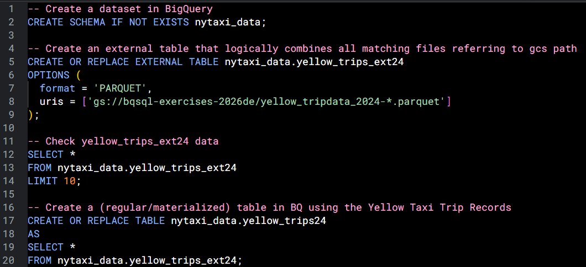
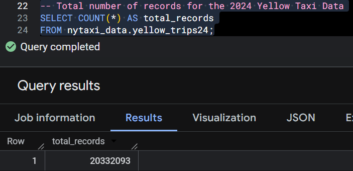
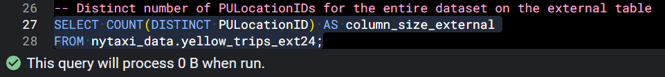
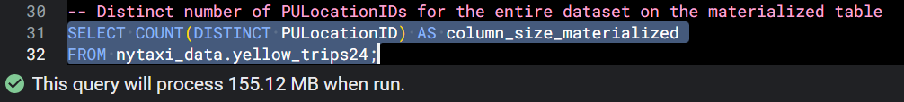
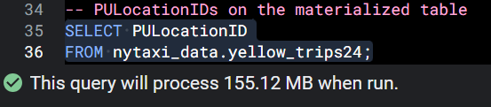
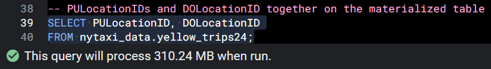
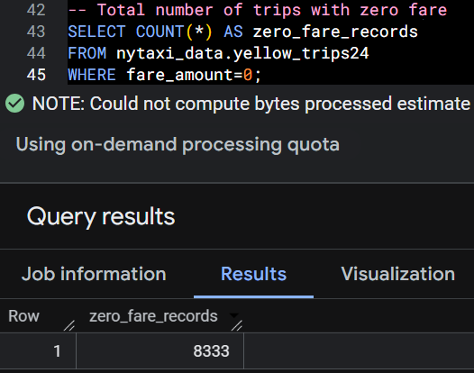
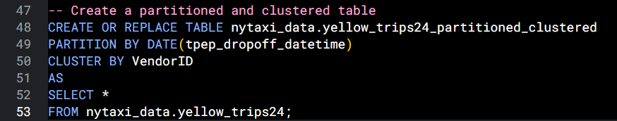
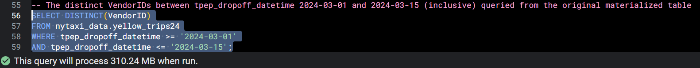
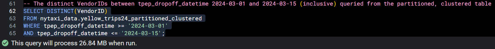

This file contains my solutions for Module 03 Homework: Data Warehouse from the Data Engineering Zoomcamp 2026, focusing on ingesting NYC Yellow Taxi trip data into **Google Cloud Storage** and analyzing it in **BigQuery**. The assignment covers creating **external and materialized tables**, exploring **query performance and data scans**, and applying optimization techniques such as **partitioning and clustering** to improve efficiency.

## BigQuery Setup
- Create an external table using the Yellow Taxi Trip Records.
- Create a (regular/materialized) table in BQ using the Yellow Taxi Trip Records (do not partition or cluster this table).

In this step, I created a **BigQuery dataset** and connected the **NYC Yellow Taxi Parquet files** stored in **Google Cloud Storage** using an **external table**. The external table logically combines all matching files without copying the data into BigQuery. I then created a **regular (materialized) BigQuery table** from the external table to enable **faster querying** and further **optimization**.

 

## Question 1. Counting records
What is count of records for the `2024 Yellow Taxi Data`?

**Solution**: 20,332,093 records.

## Question 2. Data read estimation
Write a query to count the distinct number of `PULocationIDs` for the entire dataset on both the tables. What is the estimated amount of data that will be read when this query is executed on the External Table and the Materialized Table?

**Solution**: In this example, BigQuery is able to use metadata for the external table query, while the materialized table query requires scanning the relevant column, resulting in higher data processed. **0 MB for the External Table and 155.12 MB for the Materialized Table.**

 

## Question 3. Understanding columnar storage
Write a query to retrieve the `PULocationID` from the table (not the external table) in BigQuery. Now write a query to retrieve the `PULocationID` and `DOLocationID` on the same table. Why are the estimated number of Bytes different?

**Solution**: BigQuery is a columnar database, and it only scans the specific columns requested in the query. Querying two columns (`PULocationID`, `DOLocationID`) requires reading more data than querying one column (`PULocationID`), leading to a higher estimated number of bytes processed.

The estimated bytes approximately doubled because BigQuery is a columnar database and both `PULocationID` and `DOLocationID` are similar-sized columns, so scanning two columns required reading roughly twice the amount of data.

 

## Question 4. Counting zero fare trips
How many records have a fare_amount of 0?

**Solution**: 8,333 records.

 

## Question 5. Partitioning and clustering
What is the best strategy to make an optimized table in Big Query if your query will always filter based on `tpep_dropoff_datetime` and order the results by `VendorID`? Create a new table with this strategy.

**Solution**: Partition by `tpep_dropoff_datetime` and Cluster on `VendorID`.

Minimizing scanned data and cost by:
- - **Partition by `DATE(tpep_dropoff_datetime)`** allows BigQuery to scan only the relevant date ranges when filtering by dropoff time.
- **Cluster by `VendorID`** groups similar vendor values together within each partition, making ordering and filtering by vendor more efficient.

 

## Question 6. Partition benefits
Write a query to retrieve the distinct `VendorID`s between `tpep_dropoff_datetime` 2024-03-01 and 2024-03-15 (inclusive)

Use the materialized table you created earlier in your from clause and note the estimated bytes. Now change the table in the from clause to the partitioned table you created for question 5 and note the estimated bytes processed. What are these values?

**Solution**: 310.24 MB for non-partitioned table and 26.84 MB for the partitioned table.

 

## Question 7. External table storage
Where is the data stored in the External Table you created?

**Solution**: The external table stores only metadata in BigQuery, while the actual data remains in Parquet files stored in Google Cloud Storage. Therefore, the external table reads data directly from the **GCP bucket**.

 

## Question 8. Clustering best practices
It is best practice in Big Query to always cluster your data:

**Solution**: **False**. Clustering is helpful only when queries regularly filter or group by certain columns. Otherwise, it just adds extra work for BigQuery when loading and organizing the data without improving query performance. For example, clustering a small table that usually scanned fully will slow down data loads but won’t make queries any faster.

 

## Question 9. Understanding table scans
Write a `SELECT count(*)` query FROM the materialized table you created. How many bytes does it estimate will be read? Why?

**Solution**: Although a `COUNT(*)` query would normally require scanning all rows in a table, BigQuery can optimize this operation by using table metadata to determine the row count without reading the underlying column data. As a result, the estimated bytes processed is shown as **0**, since no actual data blocks are scanned.

