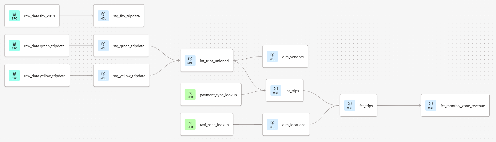

# Module 04 — Analytics Engineering with dbt

## Overview
This module focuses on building a modern **analytics engineering pipeline** using **dbt (data build tool)** on top of **BigQuery**, transforming raw trip data into clean, tested, and analytics-ready models.

It demonstrates:
- Different ingestion strategies (overwrite vs incremental)
- End-to-end warehouse modeling
- dbt builds **staging → intermediate → marts**
- Modular SQL transformations
- Fact & dimension modeling
- Data quality testing with dbt
- Reporting-ready aggregations




Raw Data (NYC TLC) ➜ BigQuery (raw dataset) ➜ dbt Staging Models ➜ dbt Intermediate Models ➜ dbt Marts (Facts & Dimensions) ➜ Reporting Models

Source datasets land in BigQuery first, then dbt builds the analytics layer on top.


## Datasets
This project uses NYC Taxi & FHV datasets:
- Yellow Taxi
- Green Taxi
- FHV (For-Hire Vehicles)

Taxi zone and payment type lookup tables are loaded via **dbt seeds**.

## Data Ingestion
Data ingestion happens before dbt runs.
dbt assumes that raw tables already exist in BigQuery.

This repository supports two ingestion approaches:

### 1. Python-based Ingestion (FHV)
File: `fhv_data_ingest.py`

- Loads monthly parquet files
- Writes to BigQuery
- Replaces data per file


| Property        | Behavior                                |
|----------------|------------------------------------------|
| Staging type    | Materialized table                      |
| Idempotency     | Replace by file                         |
| Rerun behavior  | Full rewrite of that file’s data        |
| Transformation  | From staging table                      |
| Use case        | Deterministic batch ingestion           |

### 2. Kestra-Orchestrated Ingestion ([from Module 02](../module-02/kestra-cloud-elt/))
When using orchestration:
- Raw files land in Google Cloud Storage
- BigQuery external tables are created
- Data merged into native tables


| Property        | Behavior                                |
|----------------|------------------------------------------|
| Staging type    | External table               |
| Idempotency     | Merge on row key                        |
| Rerun behavior  | Insert only missing rows                |
| Transformation  | From external table                     |
| Use case        | Incremental production-style pipeline   |


## dbt Project Structure
```md
models/
    staging/
    intermediate/
    marts/
macros/
seeds/
analyses/
tests/
```


## dbt modeling layers

### Staging (`models/staging`)
Defines sources (sources.yml) and creates cleaned stg_* models:
- Sources defined in: `models/staging/sources.yml`
- Staging models:
  - `stg_fhv_tripdata.sql`
  - `stg_green_tripdata.sql`
  - `stg_yellow_tripdata.sql`
- Applies standard cleaning/casting and basic schema tests in schema.yml.

### Intermediate (`models/intermediate`)
Creates transformation-focused models that standardize and combine data before marts:
- `int_trips.sql`
- `int_trips_unioned.sql`
- These typically unify/standardize trip datasets before building marts.

### Marts (`models/marts`)
Analytics-ready facts/dimensions and reporting models:
- Dimensions: `dim_locations.sql`, `dim_vendors.sql`
- Fact: `fct_trips.sql`
- Reporting:
  - `reporting/fct_monthly_zone_revenue.sql`
  - `reporting/schema.yml`

Example output:


### Macros (`macros/`)
Reusable SQL utilities:
- `safe_cast.sql` - safer type casting patterns
- `get_trip_duration_minutes.sql` - computes trip duration in minutes
- `get_vendor_names.sql` - maps vendor IDs to names (or standardized vendor labels)
- `macros_properties.yml` - macro documentation/properties

### Seeds (`seeds/`)
Static reference tables:
- `taxi_zone_lookup.csv` - TLC taxi zone lookup
- `payment_type_lookup.csv` - payment type mapping
- `seeds_properties.yml` - seed configuration/docs

### Analyses (`analyses/`)
Ad-hoc SQL queries for validation and exercises:
- `green_trip_count_oct_2019.sql` - trip counts for Oct 2019 (green)
- `green_taxi_top_revenue_zones_2020.sql` - top revenue zones (green, 2020)
- `monthly_revenue_records_count.sql` - record counts for monthly revenue reporting
- `fhv_data_filtered_row_nums.yml` - FHV filtering + row number checks

## Data Quality & Tests
dbt tests include:
- not_null
- unique
- accepted_values
- relationship tests

Example test failure:


## How to run (dbt Cloud + BigQuery)
This project was built and executed using **dbt Cloud** connected to **BigQuery**.

1. **GCP Setup:**
    - Enable BigQuery API
    - Create Service Account
    - Grant roles:
        - **BigQuery Data Editor**
        - **BigQuery Job User**
        - **BigQuery User**
    - Generate JSON key
2.  **dbt Cloud Setup:**
    - Create environment
    - Choose BigQuery warehouse
    - Upload service account JSON
    - Set:
        - Project ID
        - Target dataset
        - Location (EU/US)
    - Connect the project to a repo provider (e.g. GitHub)
    - **“Initialize dbt project”** to generate the base dbt structure
3. **Run Models:**
```bash
dbt seed
dbt run
dbt test
```

## Summary
- Applied modern analytics engineering patterns using dbt on BigQuery
- Designed clear separation between ingestion, transformation, and reporting layers
- Compared ingestion idempotency strategies and their impact on reruns
- Structured a scalable dbt project using layered modeling (staging → intermediate → marts)
- Implemented dimensional modeling with fact and dimension tables
- Enforced data integrity using schema and data tests
