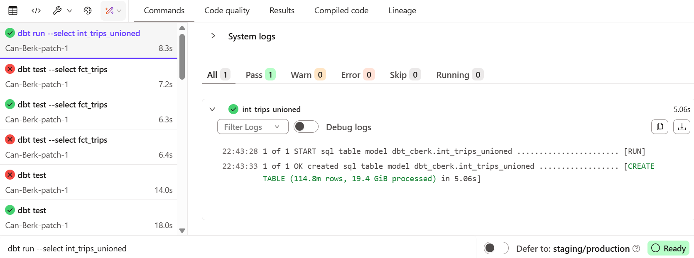
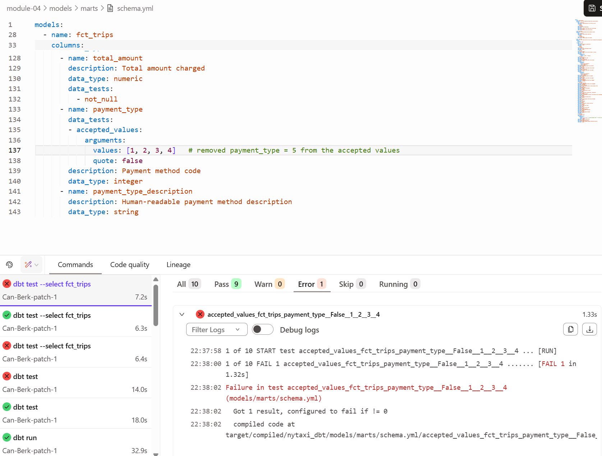
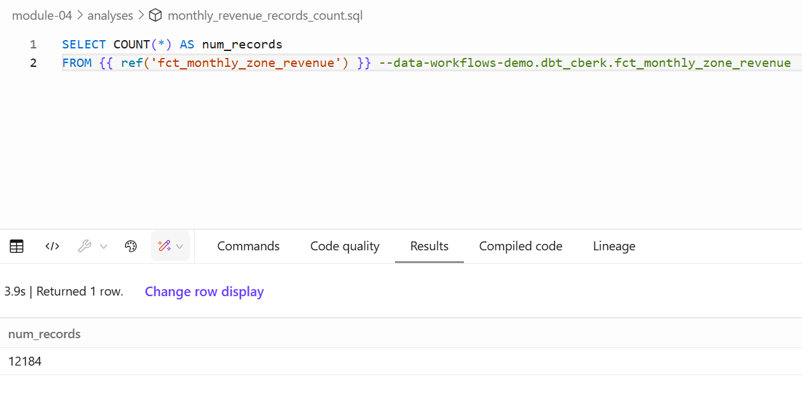
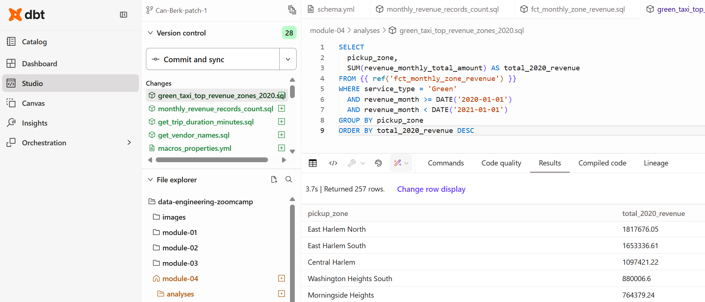
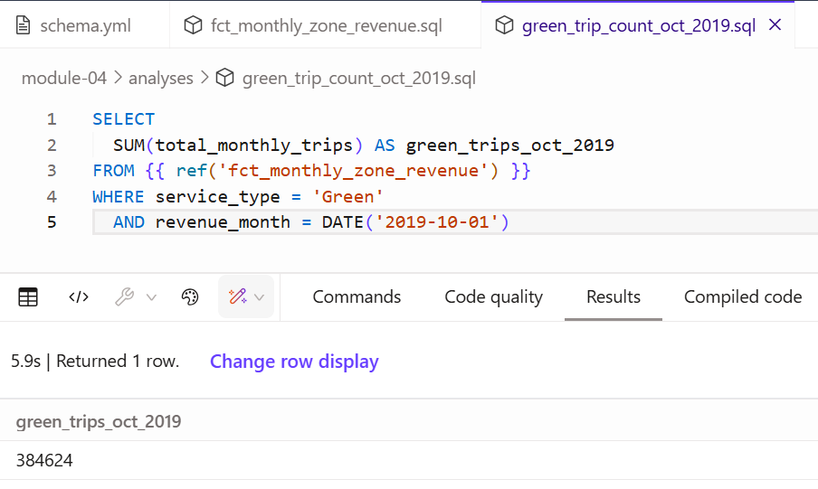
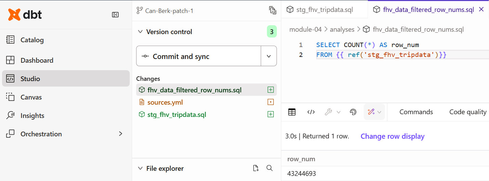

This file contains solutions for Module 04 Homework: Analytics Engineering from the Data Engineering Zoomcamp 2026, focusing on transforming NYC Taxi data using dbt with BigQuery, building staging, intermediate, and fact models, and applying data quality tests and lineage-based execution.

# Question 1. dbt Lineage and Execution
Given a dbt project with the following structure:

```postgresql
models/
├── staging/
│   ├── stg_green_tripdata.sql
│   └── stg_yellow_tripdata.sql
└── intermediate/
    └── int_trips_unioned.sql (depends on stg_green_tripdata & stg_yellow_tripdata)
```

If you run `dbt run --select int_trips_unioned`, what models will be built?


**Solution**: `int_trips_unioned` only. Because --select int_trips_unioned selects exactly that node, dbt will not automatically include upstream or downstream unless it is explicitly stated with the selector  `+`.


| Command | Result |
|------------|------------|------------|---------------------------|
| `dbt run --select +int_trips_unioned`  | upstream + the model |
| `dbt run --select int_trips_unioned+` | the model + downstream |
| `dbt run --select +int_trips_unioned+`| upstream + downstream |




<br>

# Question 2. dbt Tests
You've configured a generic test like this in your `schema.yml`:

```yaml
columns:
  - name: payment_type
    data_tests:
      - accepted_values:
          arguments:
            values: [1, 2, 3, 4, 5]
            quote: false
```

Your model `fct_trips` has been running successfully for months. A new value `6` now appears in the source data.

What happens when you run `dbt test --select fct_trips`?

**Solution**: The **accepted_values** test query will find rows that violate the rule (`payment_type = 6`). **dbt will fail the test, returning a non-zero exit code**.

| Command | Runs models | Runs tests | Exit code |
|------------|------------|------------|---------------------------|
| `dbt run`  | Yes | No | `0` |
| `dbt test` | No | Yes| non-zero |
| `dbt build`| Yes | Yes | non-zero |




<br>

# Question 3. Counting Records in `fct_monthly_zone_revenue`
After running your dbt project, query the `fct_monthly_zone_revenue` model.

What is the count of records in the `fct_monthly_zone_revenue` model?


**Solution**: **12,184**.



<br>

# Question 4. Best Performing Zone for Green Taxis (2020)
Using the `fct_monthly_zone_revenue` table, find the pickup zone with the highest total revenue (`revenue_monthly_total_amount`) for **Green** taxi trips in 2020.

Which zone had the highest revenue?


**Solution**: **East Harlem North**.



<br>

# Question 5. Green Taxi Trip Counts (October 2019)
Using the `fct_monthly_zone_revenue` table, what is the total number of trips (`total_monthly_trips`) for Green taxis in October 2019?


**Solution**: **384,624**.



<br>

# Question 6. Build a Staging Model for FHV Data
Create a staging model for the [For-Hire Vehicle (FHV)](https://github.com/DataTalksClub/nyc-tlc-data/releases/tag/fhv) trip data for 2019.

1. Load the FHV trip data for 2019 into your data warehouse
2. Create a staging model `stg_fhv_tripdata` with these requirements:
  
   - Filter out records where `dispatching_base_num IS NULL`
   - Rename fields to match your project's naming conventions (e.g., `PUlocationID` → `pickup_location_id`)

What is the count of records in `stg_fhv_tripdata`?


**Solution**: **43,244,693**.

