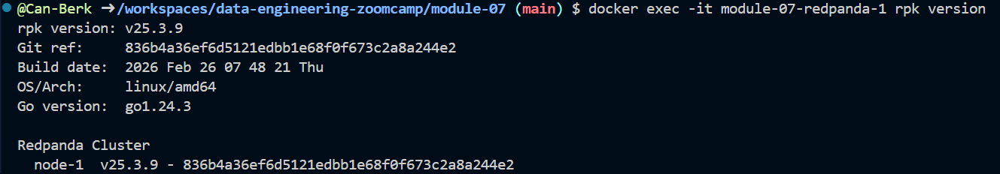
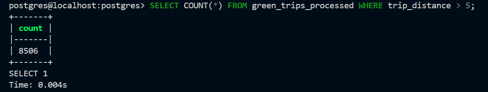
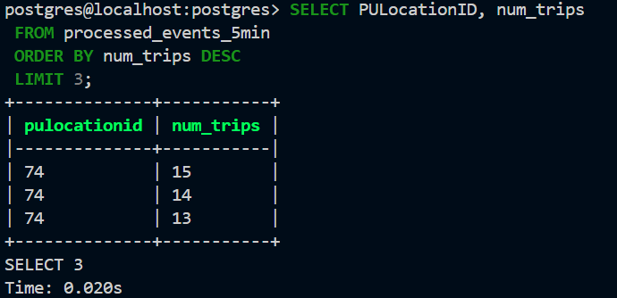
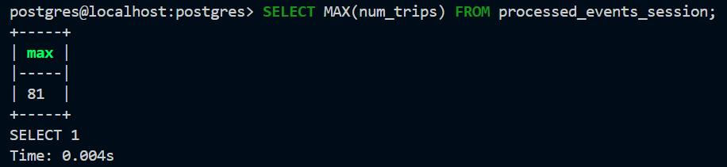
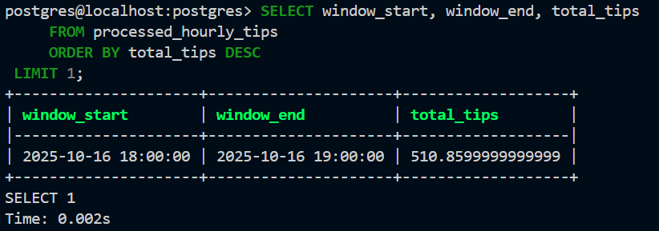

This file contains solutions for Module 07 Homework: Streaming from the Data Engineering Zoomcamp 2026. It focuses on building a real-time data pipeline using Redpanda (Kafka-compatible), PyFlink, and PostgreSQL. The tasks include producing and consuming NYC Taxi trip data streams, implementing window-based aggregations using Flink (tumbling and session windows), and writing processed results into a database for analysis.

# Kafka (Redpanda) and PyFlink Stream Processing Exercises

# Question 1: Redpanda version

Run `rpk version` inside the Redpanda container:

```
docker exec -it workshop-redpanda-1 rpk version
```

What version of Redpanda are you running?

**Solution:** v25.3.9.




# Question 2. Sending data to Redpanda

Create a topic called `green-trips`:

```
docker exec -it workshop-redpanda-1 rpk topic create green-trips
```

Now write a producer to send the green taxi data to this topic.

Read the parquet file and keep only these columns:

- lpep_pickup_datetime
- lpep_dropoff_datetime
- PULocationID
- DOLocationID
- passenger_count
- trip_distance
- tip_amount
- total_amount

Convert each row to a dictionary and send it to the `green-trips` topic. You'll need to handle the datetime columns - convert them to strings before serializing to JSON.

Measure the time it takes to send the entire dataset and flush:

```
from time import time

t0 = time()

# send all rows ...

producer.flush()

t1 = time()
print(f'took {(t1 - t0):.2f} seconds')
```

How long did it take to send the data?

**Solution:** 10 seconds.

Data is produced to the `green-trips` topic using a Kafka producer implemented in [`producer_exercise.py`](./src/producers/producer_exercise.py), which reads the NYC taxi dataset, formats records as JSON, and streams them to Redpanda.


# Question 3: Consumer - trip distance

Write a Kafka consumer that reads all messages from the `green-trips` topic (set `auto_offset_reset='earliest'`).

Count how many trips have a `trip_distance` greater than 5.0 kilometers.

How many trips have `trip_distance` > 5?

**Solution:** 8506.

A Kafka consumer implemented in [`consumer_exercise.py`](./src/consumers/consumer_exercise.py) reads messages from the `green-trips` topic and processes them to count trips with `trip_distance > 5`.



Part 2: PyFlink (Questions 4-6)
# Question 4: Tumbling window - pickup location

Create a Flink job that reads from `green-trips` and uses a 5-minute tumbling window to count trips per PULocationID.

Write the results to a PostgreSQL table with columns: `window_start`, `PULocationID`, `num_trips`.

After the job processes all data, query the results:

```sql
SELECT PULocationID, num_trips
FROM <your_table>
ORDER BY num_trips DESC
LIMIT 3;
```

Which `PULocationID` had the most trips in a single 5-minute window?

**Solution:** 74.

A PyFlink streaming job in [`aggregation_job_exercise4.py`](./src/job/aggregation_job_exercise4.py) computes trip counts per `PULocationID` using a 5-minute tumbling window with event-time processing.




# Question 5: Session window - longest streak
Create another Flink job that uses a session window with a 5-minute gap on `PULocationID`, using `lpep_pickup_datetime` as the event time with a 5-second watermark tolerance.

A session window groups events that arrive within 5 minutes of each other. When there's a gap of more than 5 minutes, the window closes.

Write the results to a PostgreSQL table and find the `PULocationID` with the longest session (most trips in a single session).

How many trips were in the longest session?

**Solution:** 81.

A PyFlink job in [`aggregation_job_exercise5.py`](./src/job/aggregation_job_exercise5.py) applies session windows with a 5-minute gap per `PULocationID` to identify the longest sequence of trips within continuous activity periods.




# Question 6: Tumbling window - largest tip
Create a Flink job that uses a 1-hour tumbling window to compute the total `tip_amount` per hour (across all locations).

Which hour had the highest total tip amount?

**Solution:** 2025-10-16 18:00:00.

A PyFlink job in [`aggregation_job_exercise6.py`](./src/job/aggregation_job_exercise6.py) aggregates total `tip_amount` using a 1-hour tumbling window to determine peak tipping periods.


