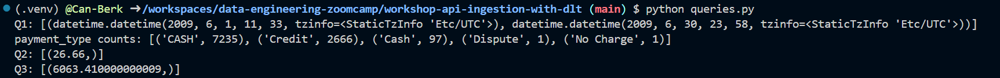

# API Ingestion with dlt
This document contains solutions for the API ingestion workshop from the Data Engineering Zoomcamp 2026, focusing on building a paginated data ingestion pipeline using dlt and DuckDB.

---

# Data Source
|------------|-------|
| Base URL   | `https://us-central1-dlthub-analytics.cloudfunctions.net/data_engineering_zoomcamp_api` |
| Format     | Paginated JSON |
| Page Size  | 1,000 records per page |
| Pagination | Stop when an empty page is returned |


# Question 1: What is the start date and end date of the dataset?

**Solution**: **2009-06-01 to 2009-07-01**
```sql
select
  min(trip_pickup_date_time) as min_pickup,
  max(trip_pickup_date_time) as max_pickup
from taxi_data.yellow_taxi_trips
```

# Question 2: What proportion of trips are paid with credit card?

**Solution**: **26.66%**
```sql
SELECT
  ROUND(
    100.0 * SUM(CASE WHEN LOWER(payment_type) = 'credit' THEN 1 ELSE 0 END) / COUNT(*),
    2
  ) AS credit_card_percentage
FROM taxi_data.yellow_taxi_trips;
```

# Question 3: What is the total amount of money generated in tips?

**Solution**: **$6,063.41**
```sql
select sum(tip_amt) as total_tips
from taxi_data.yellow_taxi_trips
```

# Query Results
